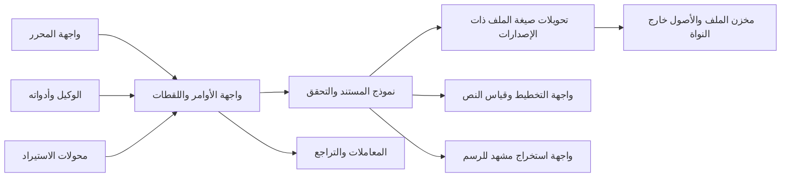

# المواصفة التقنية للنواة الجوهرية

> **تاريخ مراجعة المصادر:** 5 أكتوبر 2026  
> **الحالة:** مرجع معماري؛ حالة التنفيذ ونتائج التحقق موضحة في الأقسام ذات الصلة وسجل ADR، ولا تعني اكتمال المنتج  
> **الترخيص المقصود للنواة:** MIT  
> **المرجعية:** منتج مستقل يبدأ من الصفر. OpenPencil ليس قاعدة كود ولا مصدراً لوراثة معماريته.

## الملخص التنفيذي

تُبنى النواة مكتبة Rust مستقلة عن واجهة المستخدم، ومحرك الرسم، ونظام الملفات، ومزودي الذكاء الاصطناعي. وظيفتها امتلاك معنى مستند التصميم والتحقق من سلامته وتطبيق تعديلات قابلة للتراجع وإنتاج تغييرات قابلة للعرض أو الحفظ.

القرارات التأسيسية المقترحة:

1. **نبني نموذج المستند ودلالاته داخل المشروع.** لا نعتمد مخطط بيانات محرر آخر بصفته نموذج المنتج.
2. **نعتمد واجهة أوامر ومعاملات ذرية.** كل دفعة إما أن تحقق القيود وتُعتمد كاملة، أو تُرفض بلا أثر جزئي.
3. **نفصل الحالة المحفوظة عن حالة جلسة التحرير.** الاختيار، المؤشر، التكبير، التحديد، وذاكرة الرسم المخبأة ليست جزءاً من المستند.
4. **نفصل نموذج Rust الداخلي عن صيغة الملف وعن واجهات اللغات الأخرى.** لكل منها إصدار وحدود توافق مستقلة.
5. **نؤجل CRDT والتعاون المتزامن وواجهة C/WASM العامة** إلى أن توجد حاجة مثبتة واختبارات توافق محددة.
6. **نرخص الشيفرة التي يملكها المشروع تحت MIT**، مع سجل تراخيص واعتمادات مستقل لكل مكتبة خارجية.

كلمة «صلبة» في هذه المواصفة تعني سلوكاً محدداً يمكن اختباره: سلامة المستند، ذرية التعديل، وضوح أخطاء الإدخال، قابلية ترحيل الملفات، وسياسة توافق API. لا يمكن لوثيقة أن تضمن الجودة أو الأداء قبل التنفيذ والقياس.

## 1. الغرض والمستهلكون

تحدد هذه الوثيقة عقد النواة التي يمكن أن تستخدمها لاحقاً:

- واجهة تحرير سطح مكتب أو ويب.
- أدوات Headless للاستيراد والتحويل والتقييم.
- وكيل يطلب تغييرات دلالية عبر أوامر المنتج.
- محولات منفصلة للتخطيط والرسم والنص والتصدير.
- مطورون خارجيون يستخدمون مكتبة Rust المرخصة MIT.

لا تحدد هذه الوثيقة فلسفة التصميم المرئي، أو واجهة المنتج، أو مكتبة رسم نهائية، أو وعد توافق مع Figma. هذه المتطلبات يجب أن تأتي من مواصفة المنتج ومجموعة الملفات المرجعية.

## 2. حدود النواة

### مسؤوليات النواة

- هوية المستند والصفحات والعقد والعلاقات بينها.
- دلالات العقد والخصائص والقيم القابلة للتحرير.
- أوامر الإنشاء والنقل والتعديل والحذف والتحقق.
- تجميع الأوامر في معاملات، وتوليد التغيير العكسي وسجل التراجع والإعادة.
- التحقق البنيوي والدلالي وإعطاء أخطاء محددة.
- لقطة قراءة ثابتة ومجموعة تغييرات تصف ما تغير.
- واجهة لصيغة مستند ذات إصدارات وترحيلات صريحة.
- واجهات مجردة لخدمات اختيارية مثل التخطيط وقياس النص ومخزن الأصول.

### خارج النواة

- رسم البكسلات وإدارة GPU ونافذة التطبيق وأحداث الإدخال.
- الوصول المباشر إلى القرص أو الشبكة أو الخطوط المثبتة على النظام.
- نموذج الذكاء الاصطناعي، نصوص التوجيه، فوترة الطلبات، أو سياسة الصلاحيات.
- مزامنة متعددة المستخدمين وCRDT في الإصدار الأول.
- فك ملفات الصور وSVG وPDF غير الموثوقة؛ تتم هذه في محولات محصورة بحدود موارد.
- صيغة Figma المحلية أو ضمان التوافق معها.

لا تستورد النواة أي اعتماد من طبقة التطبيق. تعتمد الطبقات العليا على النواة؛ ولا تستدعي النواة Vue أو Tauri أو محرك رسم.

## 3. مبادئ السلامة والثبات

1. **مصدر حقيقة واحد:** نموذج المستند هو الحالة المرجعية؛ تخطيط العناصر ونتائج الرسم والفهارس المساعدة مشتقة ويمكن إعادة بنائها.
2. **هوية ثابتة:** لا تستخدم مواضع العناصر داخل مصفوفة أو أرقام الصفوف كمعرّفات دائمة.
3. **لا تعديل مباشر:** كل تغيير يمر من أمر يطبق التحقق والسياسة نفسها، سواء أتى من المستخدم أو وكيل أو مستورد.
4. **رفض صريح:** لا تتساهل API في قيم غير صالحة، ولا تصلحها بصمت عند الكتابة.
5. **قابلية التكرار:** يجب أن تعطي الأوامر نفسها على الحالة نفسها النتيجة الدلالية نفسها. نتائج الخطوط أو العرض لا تدعى متطابقة بين الأنظمة إلا عند تثبيت مدخلاتها وإصداراتها.
6. **كل شيء قابل للفشل موصوف:** عمليات الإدخال والتحويل تعيد أنواع أخطاء؛ لا تستخدم panic لمعالجة ملف أو طلب غير صالح.
7. **لا بيانات تشغيلية ضمن المستند:** لا تحفظ المؤشر أو تحديد المستخدم أو حالة النافذة داخل محتوى التصميم.
8. **لا وعود توافق مبكرة:** لا تثبّت مخطط الملف أو API عامة قبل مرورها على مراجعة التوافق وأمثلة استخدام حقيقية.

## 4. شكل المعمارية

### وحدات منطقية

| الوحدة | الملكية | ما لا تملكه |
|---|---|---|
| `geometry` | الأعداد المنتهية والأحجام والتحويلات المحلية (ADR-0002) | وحدات البكسل وذاكرة GPU |
| `props` | خصائص العقدة ودلالات fixed/fill/hug والطلاء والشكل والنص والإطار | كيف تُشكَّل أو تُرسم أو تُخطَّط |
| `model` | المستند والصفحات والعقد والأنماط والعلاقات | وحدات البكسل وذاكرة GPU |
| `ids` | أنواع الهوية ومصادر توليدها | ترتيب العقد أو موضعها |
| `commands` | الأوامر والتحقق السابق للتطبيق | واجهة المستخدم أو نص prompt |
| `transaction` | التطبيق الذري وحساب التغييرات | كتابة الملفات أو الشبكة |
| `history` | عمليات العكس وإعادة التطبيق وحدود مجموعة التراجع | مزامنة موزعة |
| `validation` | قواعد سلامة المستند وتقارير الأخطاء | تصحيح صامت للبيانات |
| `snapshot` | قراءة متسقة وفهارس مشتقة | تعديل الحالة الأصلية |
| `engine` | الكاتب الواحد الذي يملك المستند والتاريخ معاً | التفاوض بين كتاب متزامنين |
| `format` | DTOs النسخ المحفوظة والترحيل | تعريفات Runtime العامة مباشرة |
| `layout_adapter` | عقد تحويل دلالات التخطيط إلى محرك خارجي | جعل Taffy/Yoga مصدر حقيقة المستند |
| `text_adapter` | عقد القياس والتشكيل ومعلومات النص | امتلاك محرف/خط خاص بنظام تشغيل داخل المستند |
| `render_adapter` | عقد استخراج المشهد والرسم وإبطال النتائج | الكتابة إلى المستند أو امتلاك دلالات التصميم |

ابدأ بcrate واحدة ذات وحدات داخلية واضحة. قسّمها إلى crates عامة منفصلة فقط إذا اختلفت أهداف البناء أو التبعيات أو دورة الإصدارات؛ كثرة الحزم لا تجعل الحدود صحيحة وحدها. يسمح Cargo بتجميع حزم المشروع في workspace ومشاركة إعدادات الإصدارات والاعتمادات، ويظل قرار نشر كل حزمة منفصلاً. [Cargo Workspaces](https://doc.rust-lang.org/cargo/reference/workspaces.html)

## 5. نموذج المستند

### 5.1 الحالة الدائمة وحالة الجلسة

الحالة الدائمة تحتوي بيانات التصميم المقصودة: معرف المستند، بيانات وصفية ضرورية، الصفحات، العقد، الترتيب، الخصائص، الأنماط والمراجع إلى الأصول. حالة الجلسة منفصلة وتشمل التحديد والمؤشر والتكبير واللوحات المفتوحة وحالة سحب مؤقتة.

يفصل مخطط Runtime عن DTO المحفوظ. لا تستخدم `derive(Serialize, Deserialize)` على أنواع Runtime باعتباره عقد صيغة الملف؛ تُحوّل البيانات إلى بنية إصدار محدد في وحدة `format`.

### 5.2 بنية المشهد

قرارات M0 المعتمدة:

- المستند يملك صفحات مرتبة.
- لكل صفحة قائمة جذور مرتبة.
- العقد ذات معرف دائم ونوع معروف وخصائص مشتركة وبيانات نوعية.
- الترتيب البصري صريح وحتمي، ولا يعتمد على ترتيب HashMap.
- لكل عقدة أب واحد كحد أقصى؛ وتمنع الدورات.
- التمثيل القانوني هو قائمة أطفال مرتبة يملكها الأب؛ فهرس الأب داخل `Document` مشتق وقابل لإعادة البناء. لا تخزن `parent_id` أو `order_key` كمصدر ثانٍ للحقيقة. القرار يطابق التنفيذ الحالي. انظر [ADR-0001](../adr/0001-core-model-invariants.md).
- أي عملية نقل تغيّر الأب والترتيب كمعاملة واحدة وتحافظ على `NodeId` نفسه. لا يتوقف هذا الضمان على اختيار تمثيل داخلي بعينه.
- لا نعتمد fractional indexing في M0؛ يعاد فتح القرار فقط إذا دخل التعاون المتزامن ضمن نطاق منتج مثبت. تجربة Figma دليل على استخدامه في سياق تعاوني، وليست دليلاً على ملاءمته لمحرر فردي. [Figma: multiplayer technology](https://www.figma.com/blog/how-figmas-multiplayer-technology-works/) · [Figma: ordered sequences](https://www.figma.com/blog/realtime-editing-of-ordered-sequences/)
- مراجع الأنماط والمكونات والأصول تشير إلى معرفات، ولا تنسخ هوية الهدف داخل العنصر.
- المكونات والنسخ والتجاوزات والمتغيرات خارج نطاق نموذج M0 ومخططه الدائم إلى أن تحدد مهمة إطلاق تتطلبها. إذا دخلت لاحقاً، يكون للمكوّن معرف دائم، وتستند التجاوزات إلى معرف عقدة/خاصية ثابت لا إلى اسم الطبقة أو موضعها في القائمة؛ وتثبت قواعد النسخ المتداخلة والترحيل قبل إدخالها.

أنواع M0 الحالية والمعتمدة: Frame، Group، Shape، Text، Image. هذا يثبت مجموعة الأنواع البنيوية فقط؛ خصائص الهندسة والطلاء والتخطيط والنص تتطلب قرارات مستقلة، ولا يعني وجود النوع اكتمال دعمه في المنتج.

### 5.3 قواعد الثبات

- `DocumentId`, `PageId`, `NodeId`, `AssetId` أنواع منفصلة حتى لا يمر معرف من نوع مكان نوع آخر.
- الهوية لا تتغير عند النقل أو إعادة التسمية أو ترتيب الأشقاء.
- يمكن للمستورد توفير معرفات محددة؛ ويجب أن يرفض التعارض أو يحله بسياسة معلنة قبل إدخال البيانات.
- لا تكشف بنية الحاوية الداخلية للعميل عبر حقول عامة قابلة للتعديل.
- تعتمد معرفات المشروع UUID v4 داخل newtypes (`DocumentId`, `PageId`, `NodeId`, `AssetId`). استخدام v4 مناسب لمعرفات لا تحمل ترتيباً زمنياً؛ لا تستخدم المعرفات لترميز ترتيب الأشقاء. تكشف النواة تصادم المعرف وترفضه. يظل للمستورد مسار صريح للتحقق من المعرفات الواردة. [RFC 9562](https://www.rfc-editor.org/rfc/rfc9562.html) · [توثيق uuid](https://docs.rs/uuid/latest/uuid/)

UUID v4 هو القرار الحالي لأن ترتيب الإنشاء الزمني ليس دلالة للمستند. لا ينتقل المشروع إلى v7 إلا إذا أثبتت قياسات التخزين أو الفهرسة حاجة عملية لذلك، مع قبول كشف توقيت الإنشاء في المعرف. لا تستخدم أي نسخة UUID لترميز ترتيب الأشقاء.

معرفات المستند الدائمة مستقلة عن مقبض التخزين الداخلي. يعتمد M0 `HashMap<NodeId, Node>` مع قوائم `Vec<NodeId>` مرتبة، ويعاد النظر في arena أو slot map فقط إذا أظهر benchmark على corpus أحجام مستندات حقيقية تحسناً يستحق تعقيد إعادة البناء. لا يظهر أي handle مؤقت في الملف أو API العامة. هذا قرار احتفاظ مشروط بالقياس، لا ادعاء تفوق أداء `HashMap`.

### 5.4 الأعداد والهندسة

عقد الإحداثيات **مثبت ومنفذ** في `crates/core/src/geometry.rs` ومسجل في [ADR-0002](../adr/0002-coordinate-contract.md) مع fixtures ذهبية في `tests/fixtures/coordinate-contract.v1.json`: وحدات تصميم منطقية، ومحور x موجب إلى اليمين وy موجب إلى الأسفل، وتحويل محلي لكل عقدة بستة معاملات بترتيب `[a, b, c, d, e, f]`، وتركيب تحويل الأب والابن، واتجاه دوران موجب باتجاه عقارب الساعة على الشاشة. كل عدد منتهٍ ومحدود المقدار (`Scalar::MAX_MAGNITUDE = 1e9`) ويُرفض `NaN` و`±∞` عند البناء، ويُرفض التحويل المنفرد (`GeometryError::Singular`) بدل إنتاج مصفوفة لا نهائية. يتوافق اتجاه SVG الابتدائي مع محور y للأسفل، ويدعم `Kurbo::Affine` التحويل ذي الستة معاملات بالاصطلاح نفسه، لذا يمر التحويل إلى محرك الرسم دون تبديل. [SVG 2 coordinates](https://www.w3.org/TR/SVG/coords.html) · [Kurbo Affine](https://docs.rs/kurbo/latest/kurbo/struct.Affine.html) · [ADR-0002](../adr/0002-coordinate-contract.md)

- الهندسة في وحدات تصميم منطقية لا تساوي وحدات شاشة فعلية. التحويل إلى وحدات العرض مسؤولية الواجهة أو محرك الرسم، ولا يُخزَّن تكبير العرض في المستند.
- كل عدد يدخل من مستند أو أمر يجب أن يكون محدوداً finite، وتكون الأبعاد التي لا تقبل السالب غير سالبة. هذا مفروض بالأنواع لا بالفحص بعد الحقيقة.
- يحدد عقد كل نوع الزوايا والتحويلات وترتيب تركيب المصفوفات بدقة؛ لا تترك دلالة الضرب أو نظام الإحداثيات ضمنياً.
- يحتفظ نموذج المستند بالمسار والخصائص التحريرية؛ لا يحول الشكل إلى صورة نقطية عند كل تعديل.
- النواة تملك أنواع الهندسة الخاصة بها (`Scalar`, `Size`, `Transform`) ولا تستورد أنواع مكتبة رسم. `Kurbo` مستخدم عند حدّ محرك الرسم فقط لبناء المسارات وتسطيحها بتسامح ثابت معلن، وليس في العقد الدائم ولا في المخطط. يبقى اختيار محرك Boolean ومعيار تسطيح المسارات قراراً منفصلاً. [Kurbo](https://github.com/linebender/kurbo) · [قيد Boolean في Kurbo](https://github.com/linebender/kurbo/issues/277)

### 5.5 النص والتخطيط

يحفظ المستند المحتوى النصي والخصائص الدلالية التي يتعهد المنتج بدعمها؛ نتائج القياس والإلتفاف ومواقع المؤشر بيانات مشتقة. يُحفظ في المخطط الدائم (v2) عائلة الخط ووزنه وحجمه واتجاه الفقرة ومحاذاتها ومحتوى النص، لا قيم داخلية لمحرك التخطيط. خصائص كل نوع عقدة معرّفة في `crates/core/src/props.rs` ومحفوظة في `crates/format/src/node_props.rs`، ويُرفض أي صف خصائص لا يطابق نوع العقدة.

Parley **منفذ مؤقتاً** خلف `TextLayoutEngine` في `crates/text` (الإصدار 0.11.1 مثبت بدقة، ميزة `std` فقط، بلا خطوط نظام)، مع قراءة حدود المحارف عبر Skrifa 0.44. يذكر مستودعه أن متطلب Rust الأدنى قد يرتفع في إصدارات مستقبلية حتى ضمن تحديث صغير، وهذا سبب التثبيت الدقيق. العربية وRTL مغطاتان باختبارات؛ IME والتحديد وتحرير النص ما زالت بوابة قبول مفتوحة. القرار النهائي (`DEC-TEXT-AR`) غير محسوم؛ التفاصيل والقيود المعروفة في [ADR-0006](../adr/0006-text-backend-parley.md). [Parley](https://github.com/linebender/parley)

محرك التخطيط الخارجي لا يمتلك دلالات المنتج مثل fixed/fill/hug أو قياس النص. Taffy **منفذ مؤقتاً** خلف `LayoutEngine` في `crates/layout` (الإصدار 0.14.0 مثبت بدقة، Flexbox وBlock فقط)، وقياس النص يمر عبر عقد النص وحده كي لا ينشأ رأي ثانٍ في العرض. التخطيط يملك الصندوق، والجزء الخطي من التحويل يملك الشكل؛ لذا لا يحرّك تكبير عقدة إخوتها. الحالات التي لا معنى فيها لقاعدة `hug` تُبلَّغ كتشخيص، لا تُستبدل بصمت. القرار النهائي (`DEC-LAYOUT`) غير محسوم؛ التفاصيل في [ADR-0007](../adr/0007-layout-backend-taffy.md). [Taffy](https://github.com/DioxusLabs/taffy)

### 5.6 عقود الخدمات المشتقة

كل adapter يحدد عقداً قابلاً للاختبار قبل اعتماد المكتبة خلفه:

| الخدمة | المدخل | المخرج | اعتماد النتيجة وإبطالها |
|---|---|---|---|
| التخطيط | لقطة غير قابلة للتعديل للفرع، قيود الحاوية، وحدات التصميم، إعدادات التخطيط، وبصمة قياس النص/الخطوط | حدود لكل `NodeId`، تشخيصات overflow/unsupported، وبصمة اعتماد النتيجة | لا يغيّر المستند. تحفظ النتيجة كمشتقة مرتبطة بإصدار المصدر وبصمة المحرك والخطوط والإعدادات |
| النص | نص وأنماط واتجاه/لغة وقيود التفاف ووجوه خطوط محددة من المضيف | قياسات السطر والـbaseline ومواضع clusters/الربط المطلوبة للتحرير | لا يعتمد على خطوط النظام الضمنية في اختبارات المرجع؛ تغيير الخط أو النص يبطل النتيجة |
| الرسم | لقطة مشهد، نتائج التخطيط، أصول محلولة، مقياس/color configuration، وهوية backend وإصداره | سطح أو أوامر رسم وتشخيصات ومعلومات موارد | لا يكتب إلى المستند. اختلاف backend/الخط/اللون يدخل في بصمة الصورة المرجعية |
| الهندسة | قيم أشكال ومسارات وتحويلات بوحدات معلومة | bounds وhit-test وعمليات المسار مع خطأ/تسامح معلن | نتيجة deterministic تحت إصدار وقواعد عددية معلومة؛ لا تخفي تسطيحاً أو فشلاً هندسياً |

**حالة العقود:** الثلاثة (التخطيط والنص والرسم) لها تنفيذ مؤقت خلف هذه العقود: `TaffyLayoutEngine` و`ParleyTextEngine` و`VelloCpuRenderer`، وكل عقد يعيد بصمة (محرك + خطوط + إعدادات)، لأن الصورة أو التقرير المرجعي لا يُقارن بلا بصمة. عقد الهندسة منفذ داخل النواة (`geometry.rs`) ويُستهلك عند حدّ الرسم. كل تنفيذ يسجل حالاته غير المدعومة كتشخيصات مصنّفة بدل الإسقاط الصامت، ويتحقق الاختبار الشامل من تمرير مستند واحد عبر العقود الثلاثة إلى PNG وتقرير layout ومقارنتهما بمراجع مقفلة: `crates/tools/tests/m0_vertical_slice.rs`.

لا يتضمن adapter مرجعاً عكسياً إلى `DocumentEngine`. تشتق مفاتيح cache من `revision` وبصمات اعتماد النتيجة، وتصل invalidation من مجموعة التغيير والعلاقات المشتقة. إن لم يمكن تحديد اعتماد النتيجة أو ما يبطلها، لا تخزن في cache.

## 6. الأوامر والمعاملات والتاريخ

### 6.1 عقد الأمر

يمثل التغيير أمراً typed يتضمن الهدف والقيم الجديدة وشروطاً مسبقة عند الحاجة. أمثلة الفئات: إنشاء عقدة، حذفها، نقلها، تغيير خصائصها، تحديث ترتيب الأشقاء، أو تعديل نص.

كل أمر يحدد:

- مدخلات مصادقاً عليها نوعياً.
- نطاق العناصر المتأثرة.
- شروطاً مسبقة مثل وجود الهدف أو تطابق المراجعة.
- نتيجة ناجحة تتضمن معرفات الإنشاء ومجموعة تغييرات.
- خطأ ثابتاً ومفهوماً إذا تعذر التطبيق.
- معلومات كافية لإنشاء أمر عكسي آمن.

### 6.2 ذرية الدفعة

`apply_batch(expected_revision, commands)` هي نقطة الكتابة العامة. السلوك الإلزامي:

1. تحقق من المراجعة والحدود والصلاحيات الممررة من المضيف.
2. نفذ على حالة عمل معزولة أو سجل تغيير يمكن عكسه بالكامل.
3. تحقق من القواعد المحلية المتأثرة ومن ثوابت المستند التي تعتمد عليها العملية؛ يجب أن تكون النتيجة مكافئة لقواعد التحقق الكاملة.
4. عند النجاح، انشر الحالة مرة واحدة وارفع revision واحداً للدفعة.
5. عند أي فشل، لا تتغير الحالة الأصلية أو المراجعة أو التاريخ.

عداد المراجعة `u64` لا يلتف. إذا بلغ `u64::MAX` ترفض النواة أي دفعة جديدة بخطأ `RevisionExhausted`، لأن إعادة استخدام رقم مراجعة تكسر كشف التعارض وترتيب التاريخ.

لا تنفذ مسحاً كاملاً للمستند مع كل حدث سحب أو تغيير مؤشر. التحقق التزايدي هو مسار الالتزام بعد إثبات تكافئه مع validator مرجعي كامل؛ ويظل الفحص الكامل عند التحميل والترحيل والاستيراد، وفي الاختبارات أو فحوصات التشخيص. تفاصيل نسخة الحالة أو copy-on-write قرار تنفيذ يحسم بالقياس. لا تدع التطبيق المتدرج على الحالة الحية ثم إرجاع أفضل جهد يسمى معاملة ذرية.

### 6.3 جلسة المعاينة التفاعلية

السحب وتغيير الحجم يعرضان حالة مؤقتة فوق snapshot ولا يكتبان إلى المستند مع كل إطار:

- تبدأ `PreviewSession` من revision معروف وتحتفظ بتغييرات مؤقتة قابلة للاستبدال أو الإلغاء.
- يحسب العرض/التخطيط preview من التغييرات المؤقتة مع تحقق محلي مناسب للتفاعل.
- عند الإنهاء، تتحول الحالة النهائية إلى معاملة واحدة وكتلة Undo واحدة؛ عند الإلغاء لا يبقى أي أثر في المستند أو التاريخ.
- إذا تغير revision الأصلي قبل الالتزام، يرفض commit أو يعيد حسابه وفق سياسة تعارض محددة؛ لا يطبق قيماً قديمة بصمت.
- تدمج أحداث pointer المتتابعة في نتيجة preview أحدث، لا في سجل تاريخ دائم.

### 6.4 Undo وRedo

- يولد المحرك الأمر العكسي وقت التطبيق من الحالة الفعلية؛ لا يعتمد على طلب الوكيل كتابة عكس صحيح.
- يسجل التاريخ حدود الدفعات؛ الدفعة المركبة للمستخدم خطوة واحدة افتراضياً.
- إزالة مجموعة فرعية تحفظ ما يلزم لإعادتها بالترتيب والمراجع نفسها.
- Undo وRedo يمران من التحقق نفسه، ويعودان بخطأ واضح إذا أبطلت حالة لاحقة شرط العكس.
- تاريخ الجلسة خارج payload المستند في الإصدار الأول. استرجاع التاريخ بعد إعادة التشغيل ميزة منفصلة.
- تحتفظ الجلسة بحد خطوات وحد تقديري للبايتات. يحسب حد البايتات مدخلي undo وredo معاً، وتُزال أقدم المدخلات كاملة حتى يتحقق الحد؛ لا يُشطر عكس المعاملة. الحد الحالي 256 خطوة فقط، ولا يعلن سقف بايتات افتراضي حتى يقاس corpus ممثل. يجب أن تكشف API حالة الاحتفاظ والإخلاء للمضيف قبل اعتماد هذه السياسة تنفيذياً؛ التفاصيل في [ADR-0004](../adr/0004-undo-budget.md).
- لا توصف الدفعة بأنها ذرية بعد إدخال تعاون متعدد المستخدمين حتى تختبر حالات تغيير متزامن وفشل جزئي.

### 6.5 مجموعة التغيير

نتيجة كل معاملة تتضمن على الأقل revision السابق والجديد، ومعرفات العقد التي أضيفت/حذفت/تغيرت/نقلت، الصفحات المتأثرة، إشارات إبطال التخطيط أو الرسم، ورسائل التشخيص. لا تتضمن نتيجة التغيير صورة رندر إلزامية.

### 6.6 ملكية المستند والتزامن داخل العملية

- لكل مستند كاتب واحد في كل لحظة؛ ترتيب الكتابات تحدده queue/actor أو قفل المضيف حول `&mut DocumentEngine`.
- الوكيل والواجهة لا يعدلان النموذج بالتوازي. كلاهما يرسل أوامر إلى المالك نفسه مع `expected_revision`.
- القراءة المتزامنة تكون عبر snapshots ثابتة لا عبر مراجع قابلة للتغيير.
- لا تعلن API العامة `Send` أو `Sync` كضمان حتى يثبت ذلك في بناء CI لكل هدف. الهدف التصميمي: المحرك قابل للنقل بين threads إذا لم يحمل موارد منصة؛ والـsnapshots قابلة للمشاركة للقراءة إذا حافظت المكتبات المعتمدة على ذلك.
- هذا تنظيم للتزامن داخل العملية وليس CRDT أو تعاوناً موزعاً.

## 7. التحقق والأخطاء

المتحقق يفرض على الأقل:

- تفرد المعرفات ضمن المستند والنطاقات التي تحددها الصيغة.
- صلاحية ترتيب الصفحات والأطفال وعدم وجود مرجع إلى عنصر محذوف.
- خلو الشجرة من الدورات ومن الأبوة المتعددة.
- اتساق علاقة الأب وترتيب الأشقاء وفق التمثيل القانوني الذي يعتمده المخطط، وعدم تكرار مصدر الحقيقة.
- صلاحية المراجع إلى الأصول والأنماط والمكونات.
- صلاحية القيم العددية والأبعاد والتحويلات.
- حدود عمق الشجرة وحجم الملف وعدد العقد عند قراءة مدخل غير موثوق.
- وضوح الفرق بين خطأ بنيوي، خطأ قيمة، مرجع مفقود، نسخة ملف أحدث، حد موارد، وتعارض مراجعة.

تعيد API خطأ typed مع مسار/معرف العنصر ورمز مستقر ورسالة تشخيص. الرسالة ليست مفتاحاً برمجياً؛ تعتمد الواجهة على الرمز والبيانات. لا تتجاوز الخطأ بتصحيح قيمة أو إسقاط خاصية بلا تقرير.

وفق إرشادات Rust API، تتحقق المكتبة من المدخلات عند الحدود وتستخدم أنواعاً تمنع الحالات غير الصالحة قدر الإمكان. [Rust API Guidelines: Dependability](https://rust-lang.github.io/api-guidelines/dependability.html)

## 8. صيغة الملف والترحيل

### 8.1 طبقات منفصلة

1. **نموذج Runtime:** أنواع عملية للمحرر، غير ملزمة بالتخزين.
2. **مخطط منطقي محفوظ:** تمثيل مستقل بإصدار صريح، وحقول ذات أسماء وأنواع معرفة.
3. **الحاوية الأصلية:** ملف ZIP64 واحد حسب profile المشروع في [ADR-0003](../adr/0003-file-container.md)، وفيه `document.json` و`assets/<canonical-lowercase-uuid>` اختيارية. جميع الإدخالات Stored بلا ضغط؛ لا مجلدات أو روابط رمزية أو تشفير أو أسماء غير معروفة. الحاوية لا تستبدل إصدار المخطط والترحيلات.
4. **محولات التبادل:** SVG/Figma/PDF وغيرها، كل واحدة بحدود دعم وتشخيص مستقلة.

SerDe مناسب لطبقة تحويل الأنواع إلى/من تنسيقات متعددة؛ لا يجعل أي schema متوافقاً تلقائياً ولا يضع سياسة الترحيل. [Serde](https://serde.rs/)

### 8.2 سياسة الإصدارات

- لكل مخطط محفوظ معرف صيغة ورقم `schema_version` مستقل عن إصدار التطبيق وإصدار crate.
- لا يفتح إصدار أقدم ملفاً أحدث بتجاهل الحقول بصمت؛ يرجع خطأ `UnsupportedFutureVersion` مع رقم النسخة.
- يرفض الاستيراد نسخة أقل من أقدم نسخة معرفة (`UnsupportedPastVersion`)؛ لا يعامل رقم النسخة المجهول كأنه النسخة الحالية.
- يهاجر الإصدار الأقدم عبر خطوات صريحة ومتسلسلة إلى Runtime حديث.
- كل ترحيل حتمي، لا يتصل بالشبكة، ويبلغ عن القيم التي تعذر الحفاظ عليها.
- يجب حفظ الأصل قبل ترحيل خطير، أو يقدم المضيف نسخة مستعادة؛ لا يكتب المحرك فوق ملف المستخدم تلقائياً.
- حقل `extensions` يخصص بيانات إضافية بمساحات أسماء، وتحدد سياسة حفظها. حقول schema الأساسية المجهولة لا تهمل بصمت.
- تحتفظ DTOs بالحقول المجهولة على مستوى المستند والصفحة والعقدة والأصل و**سجل الخصائص وسجلاته الفرعية**. يرفض قارئ JSON المفاتيح المكررة في أي مستوى، والقيمة غير الكائنية لـ`extensions`، والتعارض بين مفتاح مجهول ونسخة المفتاح نفسها داخل `extensions`؛ ويرفض الكاتب مفاتيح extensions التي تتصادم مع حقول الكيان المعروفة.
- `from_json` يفرض حدود الإدخال الافتراضية قبل التحليل (64 MiB)، ثم يراجع أعداد الصفحات والعقد (10,000 و1,000,000). `import` يكرر حدود العدد ويستخدم مشياً محدود العمق (512) قبل بناء المستند؛ يمكن للمضيف تضييق الحدود عبر `ReadLimits` و`ImportLimits`.
- لا يخزن DTO مسارات ملفات محلية للأصول. اسم مدخل الأصل داخل الحاوية مشتق من `AssetId` بصيغة UUID القانونية كما يحدد ADR-0003؛ ترفض الأسماء المطلقة أو traversal أو غير المطابقة للقالب قبل قراءة الحمولة.

**الإصدار الحالي 2.** يضيف v2 سجل خصائص العقدة (تحويل، حجم، قواعد القياس، تعبئة، حدود، ومحتوى خاص بالنوع) إلى بنية v1. الترحيل v1 → v2 خطوة رفع رقم فقط، لأن القاعدة المعلنة هي أن **غياب حقل = القيمة الافتراضية لنوع العقدة**؛ أما الحقل الحاضر فيُتحقق منه بالكامل: اسم مفرداتي مجهول، أو عدد غير منتهٍ، أو خصائص لا تطابق نوع العقدة كلها أخطاء مصنّفة (`InvalidProps`)، لا رجوع صامت إلى افتراضي. الملفات المثبتة للترحيل: `tests/fixtures/document-v1-minimal.json` (إدخال v1) و`tests/fixtures/document-v2-styled.json` (v2 بخصائص صريحة لكل نوع). [ADR-0002](../adr/0002-coordinate-contract.md) يثبّت دلالة الأرقام المحفوظة.

نُفذ قارئ وكاتب profile ZIP64 المحدود، ومخزن الحمولة الثنائي، وأوامر CLI للحزم والتحقق والفك والاستعادة؛ راجع [ADR-0003](../adr/0003-file-container.md). نجح CI على Windows/Linux/macOS، مع قارئات ZIP مستقلة وfuzz موسع من 500,000 طفرة على Linux في التشغيل [37270260436](https://github.com/swotvibe/swotvibe-desing-core/actions/runs/37270260436). تبقى ملفات ممثلة من المستخدمين لتثبيت حدود الموارد الرقمية. لا توجد حالياً مجموعة ملفات منتج موثقة، لذلك لا تعد الاختبارات الاصطناعية بديلاً عنها. لا يثبت اسم امتداد عام أو ثبات صيغة عامة قبل اجتياز بوابة corpus المنتج.

## 9. واجهة المكتبة العامة

- واجهة Rust typed هي الواجهة الأولى.
- أنواع الهوية والقيم العامة لها حقول خاصة وconstructors تتحقق من الصحة.
- أنواع التعداد العامة القابلة للتوسع موسومة non-exhaustive، وتستخدم builders أو constructors حتى لا يصبح تغيير الحقول العامة كاسراً بلا داع.
- لا تكشف أنواع Kurbo/Taffy/Parley/Serde مباشرة كجزء من عقد API قبل قرار واضح؛ يمكن توفير تحويلات اختيارية أو ميزات تكامل لاحقاً. التنفيذات المؤقتة الحالية تحترم ذلك: `LayoutResult` و`ShapedText` و`RenderedImage` أنواع المشروع، ولا يظهر نوع مكتبة في توقيع عام ولا في المخطط الدائم.
- كل عنصر عام موثق، مع مثال صغير قابل للتشغيل أو رابط لمثال يغطي الغرض. تسجل التغييرات المؤثرة في CHANGELOG، ويصدر tag لكل إصدار.
- لا يضمن تمثيل الذاكرة أو layout لأنواع Rust ABI مستقراً. واجهة C محتملة لاحقاً تكون crate منفصلة بعقد `repr(C)` وأنواع أولية وملكية ذاكرة موثقة. هذا يتبع تحذير Rust Reference من افتراض ثبات layout الافتراضي. [Rust API Guidelines](https://rust-lang.github.io/api-guidelines/) · [Rust Type Layout](https://doc.rust-lang.org/reference/type-layout.html)
- لا تستخدم nightly في المنتج أو في API المنشورة.

تعريف `rust-version` / MSRV يكون بعد تثبيت الاعتمادات وبناء مصفوفة CI. يعرض Cargo هذا الحد للمستهلكين ويستخدمه لإظهار عدم التوافق. [Cargo rust-version](https://doc.rust-lang.org/cargo/reference/rust-version.html)

## 10. قرارات الاعتماد الحالية

| المجال | الحكم | حد الاعتماد |
|---|---|---|
| نموذج المستند | **نبنيه** | الملكية والدلالات والنسخ مسؤولية المنتج؛ خصائص M0 (هندسة، طلاء، شكل، نص، إطار flex) منفذة ودائمة في مخطط v2 |
| التسلسل | **نعتمد Serde كمرشح أساسي** | يستخدم عبر DTOs مخططية في وحدة format؛ لا يتسرب إلى صيغة عامة بلا إصدار |
| التخزين | **المعمارية وcodec وCLI منفذة؛ جاهزية الإطلاق غير مثبتة** | JSON versioned v2 داخل `document.json` وحاوية ZIP64 profile محدودة؛ اجتازت CI متعددة الأنظمة وfuzz وأدوات ZIP المستقلة؛ بقي corpus المستخدمين الحقيقيين (ADR-0003) |
| المعرفات | **معتمد** | newtypes للمشروع فوق UUID v4؛ لا يظهر نوع المكتبة خارجياً |
| هندسة المنحنيات | **النواة تملك الأنواع؛ Kurbo عند حدّ الرسم فقط** | `Scalar`/`Size`/`Transform` في النواة بقيم منتهية محدودة ومصفوفة قلوبة أو مرفوضة (ADR-0002)؛ Kurbo يبني المسارات بتسامح ثابت؛ لا يغطي Boolean، ويبقى قراره منفصلاً |
| التخطيط | **Taffy منفذ مؤقتاً؛ القرار النهائي مفتوح** | Flexbox وBlock فقط، بلا تقريب، وقياس النص عبر عقد النص؛ مقارنة Yoga على ملفاتنا ودلالات المنتج لم تُجرَ ([ADR-0007](../adr/0007-layout-backend-taffy.md)) |
| النص | **Parley منفذ مؤقتاً؛ القرار النهائي مفتوح** | 0.11.1 وSkrifa 0.44 مثبتان بدقة، بلا خطوط نظام وبلا تقريب؛ العربية وRTL مغطاتان، وIME/التحديد/الخطوط البديلة بوابات مفتوحة ([ADR-0006](../adr/0006-text-backend-parley.md)) |
| الرسم | **vello_cpu منفذ مؤقتاً؛ قرار المحرك معلّق** | مسار f32 وSIMD baseline لإخراج مرجعي حتمي؛ لا صور نقطية ولا تدرجات ولا طبقات بعد؛ مقارنة Vello GPU/Skia على مشاهد ومنصات فعلية لم تُجرَ ([ADR-0008](../adr/0008-render-backend-vello-cpu.md)) |
| Boolean | **iCurve مرشح للتجربة** | لا اعتماد نهائي قبل فحص التحويل والدقة والحالات الحدية على المسارات الفعلية |
| التعاون CRDT | **مؤجل** | تضاف آلية تعاونية فقط مع طلب مستخدم واختبار Yrs/Yjs وحدود Undo |
| FFI | **مؤجل** | C ABI أو WASM package منفصل بعد ثبات عقد Rust ومصفوفة الأهداف |

الاعتمادات المرشحة لا تعني اعتماداً نهائياً. التنفيذات الثلاثة للتخطيط والنص والرسم **مؤقتة**: أُدخلت ليمرّ المسار الرأسي M0 عبر عقود حقيقية، وكل واحدة تسجل حالاتها غير المدعومة وشروط خروجها. لم تُجرَ بعد تجارب المقارنة (Yoga، Vello GPU، Skia، iCurve)، ولم تُغلق `DEC-LAYOUT` و`DEC-TEXT-AR` و`DEC-RENDERER`. يشرح [تقرير البحث التقني](./technology-adoption-and-build-research.md) الأدلة والقيود، والقرارات مسجلة في [سجل ADR](../adr/README.md).

## 11. الأمان والموثوقية

- تعامل مع ملفات التصميم المستوردة والعمليات القادمة من وكيل كمدخلات غير موثوقة.
- ضع حدوداً قابلة للتهيئة للبايتات، العقد، عمق الشجرة، النص، عدد الأصول، وحجم كل أصل.
- فشل تحليل مورد لا يسقط العملية أو يفسد حالة المستند.
- لا تنفذ كوداً أو سكربتاً مضمنًا في SVG أو ملف مشروع.
- لا تتبع روابط الملفات خارج مجلد الحاوية؛ ولا تثق في أسماء المسارات الموجودة داخل الملف.
- لا تحفظ أسرار API أو مفاتيح مزود النموذج في المستند.
- تبدأ نواة Rust آمنة من دون `unsafe` محلياً. أي ضرورة لاحقة لـunsafe تتطلب تبريراً ومراجعة منفصلة؛ ويظل FFI خارج crate الأساسية.
- لا تكتب عملية الحفظ فوق الملف الأصلي قبل نجاح serialization والتحقق ونجاح كتابة النسخة المؤقتة من قبل المضيف.

## 12. المرجع المستقل والشريحة الرأسية

الاختبارات الداخلية تثبت حفظ invariants التي قررناها؛ لكنها لا تثبت أن دلالات التصميم نفسها صحيحة أو مفيدة. لذلك تفرق خطة القبول بين oracle للقواعد، ومرجع توافق، وتقييم جودة المنتج.

### 12.1 اختيار مرجع لكل ادعاء

| ما نتحقق منه | المرجع المقبول | ما لا يكفي وحده |
|---|---|---|
| invariants مثل عدم وجود دورة أو فقدان معرف عند النقل | validator مستقل، property tests، واختبارات خصائص round-trip | إعادة استخدام الدالة نفسها في المنتج والاختبار ثم اعتبار النتيجة مرجعاً مستقلاً |
| خصائص CSS Flex/Grid إذا قرر المنتج مطابقتها | نسخة مؤرخة من مواصفة W3C، حالات Web Platform Tests مناسبة، ومقارنة computed layout مع متصفحات محددة بإصداراتها | ادعاء عام أن المتصفح أو Taffy أو Figma هو المرجع لكل تخطيط تصميم |
| توافق سلوك محدد مع Figma | ملف fixture مصرح باستخدامه، سلوك/خاصية مسماة، ونسخة API/منتج مسجلة | اتخاذ Figma oracle عاماً مع أن المنتج لم يقرر التوافق معها |
| سلوك OpenPencil | مقارنة تفاضلية استكشافية لميزة معلنة ومجموعة مدخلات متطابقة | اعتباره معيار صحة أو نقل بنيته؛ فهو تنفيذ آخر وليس مواصفة معيارية |
| نتيجة الرسم | golden fixtures معتمدة يراجعها إنسان، font files وbackend وcolor config مثبتة، ومقارنة صورة مع tolerance موثق | pixel equality بين GPU أو أنظمة مختلفة بلا تثبيت المدخلات |
| جودة التصميم أو قبول المخرج | rubric مكتوب حسب المهمة، تقييم بشري أعمى/متعدد المراجعين عند الإمكان، وقياس قبول/تعديل المستخدم | درجة LLM judge منفردة أو مخرجات النموذج الذي أنشأ التصميم |

في مطابقة CSS، تكون المواصفة هي تعريف الدلالة المستهدف، أما المتصفحات فتنفيذات للمقارنة وليست إجماعاً معصوماً. WPT مجموعة اختبارات لمواصفات الويب وتغطي اختبارات ذات أنواع وحالات نضج متفاوتة؛ تُثبت revision الاختبارات المختارة ويُوثق أي استثناء. [CSS Flexbox](https://www.w3.org/TR/css-flexbox-1/) · [CSS Grid](https://www.w3.org/TR/css-grid/) · [web-platform-tests](https://github.com/web-platform-tests/wpt)

تدعم تجربة Anthropic في بناء مترجم C الحاجة إلى verifier قريب من الصحة وإلى oracle معروف عند تصحيح التوافق؛ استخدموا GCC لمقارنة أجزاء من Linux kernel بعد أن كانت المهمة الكبيرة لا تعطي الوكلاء إشارة تفريقية كافية. هذا دليل عملي لصياغة بوابات قابلة للتحقق، لا دليل على أن GCC أو Figma أو أي تطبيق بعينه يصلح oracle عاماً لمحررنا. [Anthropic: Building a C compiler](https://www.anthropic.com/engineering/building-c-compiler)

للمهام الذاتية، توصي Anthropic بتقسيم rubric إلى أبعاد ومعايرة LLM judge بخبراء بشريين، وتوثق أيضاً كيف قد تخفض أخطاء grader نتيجة نموذج جيد. لذلك تُستخدم درجات النموذج للتشخيص أو الفرز بعد قياس توافقها مع مراجعين، ولا تكون وحدها بوابة إصدار. [Anthropic: Demystifying evals for AI agents](https://www.anthropic.com/engineering/demystifying-evals-for-ai-agents)

**حالة المرجع الحالي:** يوجد مرجع تقني في `tests/golden/m0-sample.*` وعينة واجهة المحرر العربية في `tests/golden/m0-editor-ui.*`. كلاهما يسجل font hashes ومحركات التخطيط والرسم والمقياس واللون وتوليرانس البكسل؛ والهندسة والصور تقارن آلياً. مرجع واجهة المحرر يمرر PNG وصور SVG المولدة عبر فك الأصول والرسم. ما زالت مراجعة الصورتين البشرية مطلوبة؛ لا يحول نجاح المقارنة الآلية العينة إلى تصميم منتج مقبول. لا تقارن الصور بين أنظمة مختلفة قبل تشغيل مصفوفة CI؛ عند اختلافها يضاف مرجع لكل نظام بدلاً من توسيع التوليرانس.

### 12.2 بوابة M0: مسار رأسي واحد

قبل توسيع نموذج العقد أو بناء خصائص تعاون، أنجز مساراً صغيراً يمر عبر حدود النظام كاملة:

1. أنشئ مستنداً بصفحة وإطار وأشكال بسيطة ونص بخطوط/ملفات معروفة.
2. تحقق من بنية المستند ثم احفظه وأعد فتحه عبر DTO مخطط بإصدار صريح.
3. مرره عبر layout adapter واحد وrenderer واحد خلف العقدين الموثقين؛ يبقى اختيار backend مؤقتاً إن لم يحسم القرار النهائي.
4. أخرج صورة PNG وlayout report، وقارنها بالـgolden fixture المعتمدة مع إعدادات وfonts مثبتة.
5. غيّر ترتيب عنصر أو خاصية في معاملة، ثم تحقق من النتيجة ومن Undo/Redo ومن round-trip بعد الحفظ.
6. أدخل دفعة غير صالحة في آخرها وتحقق أن المستند والمراجعة والتاريخ لم تتغير.

تعريف نجاح M0: لا فقد دلالي في الحفظ/الفتح، تطابق هندسي مع القيم المرجعية ضمن tolerance معلن، ناتج بصري راجعه شخص، تراجع واحد يعيد الحالة السابقة، والدفعة الفاشلة لا تترك أثراً. لا يثبت M0 جدوى السوق ولا أداء المستندات الكبيرة؛ يثبت فقط أن النواة والعقد لا تعمل بمعزل عن أول تدفق مفيد.

**الحالة الحالية:** مسار المستند والرسم مغطى بالعينة التقنية واختبار `crates/tools/tests/m0_vertical_slice.rs`. عينة واجهة المحرر واختبار `crates/tools/tests/m0_editor_ui.rs` يضيفان اختبار مشهد عربي RTL مختلط المصطلحات، وأصول PNG/SVG، وهندسة كل العقد على 1440×900. حقل `reviewed` في مراجع PNG يسجّل الآن اعتماد المالك البصري للتنسيق واتجاه النص بتاريخ 2026-10-06، واجتازت شريحتا M0 مصفوفة CI على Windows وLinux وmacOS في التشغيل [37351705752](https://github.com/swotvibe/swotvibe-desing-core/actions/runs/37351705752)؛ بذلك أُغلقت البوابة البصرية. قرارات `DEC-LAYOUT` و`DEC-TEXT-AR` و`DEC-RENDERER` ما زالت مفتوحة؛ التنفيذ الحالي مؤقت.

### 12.3 الاختبارات والقياس قبل وصف النواة بالصلبة

هذه بوابات تصميم وتحقق للمراحل القادمة، وليست ادعاء أن العمل نُفذ:

1. **اختبارات قواعد المستند:** خصائص تبقى صحيحة بعد سلاسل أوامر وتراجعات عشوائية، مع حفظ seed وإعادة إنتاج الفشل.
2. **اختبارات الذرية:** كل فشل في موضع مختلف من الدفعة يترك revision والمحتوى والتاريخ كما كان.
3. **Golden fixtures:** ملفات مرجعية تفتح وتُحفظ دون تغيرات غير مقصودة في المعنى.
4. **ترحيل:** كل نسخة schema مدعومة لها ملفات إدخال وناتج متوقع وتقارير فقد واضحة.
5. **Fuzzing للتحليل:** بيانات مشوهة أو عميقة أو كبيرة لا تسبب panic أو تجاوز حد موارد.
6. **توافق API:** مقارنة تغييرات الواجهة العامة قبل الإصدار؛ وتغيير major لكل كسر بعد 1.0.
7. **المصفوفة:** stable Rust، MSRV معلن، Windows/Linux/macOS حسب الوعد المنشور، وwasm32 فقط بعد قبول هدف الويب.
8. **Benchmark corpus:** ملفات تصميم ممثلة لعدد العقد والتداخل والنصوص؛ تحدد baseline والعتبة قبل تفسير أي ادعاء سرعة.
9. **تراخيص:** فحص metadata لكل اعتماد مباشر وعابر عند كل تحديث، مع الاحتفاظ بنصوص الإشعارات المطلوبة.

لا يوضع رقم أداء مستهدف هنا لأن أحجام المستندات وعتاد العملاء ومسارات المنتج لم تحدد. يضاف الرقم مع baseline قابل لإعادة التنفيذ.

**حالة التغطية بعد شريحة M0:** البند 2 (الذرية) والبند 3 (المراجع: ترحيل v1→v2 وround-trip وثبات البايتات) والبند 5 (تحليل: fuzz على حاوية ZIP64) مغطاة باختبارات ملتزمة، والبند 3 بصرياً مغطى بمقارنة تقرير layout وصورة PNG بمرجع مقفل (اعتمده المالك بصرياً بتاريخ 2026-10-06). البنود 1 (property tests عشوائية) و4 (ناتج متوقع لكل نسخة schema) و6 (توافق API) و7 (مصفوفة MSRV وأهداف) و8 (benchmark corpus) لم تُنفذ بعد: لا توجد ملفات منتج ممثلة، ولا سياسة MSRV معلنة، ولا أرقام أداء مستهدفة.

### 12.4 الانضباط عند استخدام وكلاء البرمجة

- كل مهمة تنفيذ تشير إلى invariant أو fixture أو عقد API واضح، وتحدد الملفات/الإصدارات الرسمية التي يجوز الاعتماد عليها.
- أضف اختباراً صغيراً سريعاً للتغذية الراجعة، مع إبقاء مجموعة التحقق الكاملة إلزامية في CI؛ وضع fast mode لا يعوض فحص regressions الشامل.
- تجعل مخرجات الاختبارات قابلة للفرز آلياً وتتضمن حالة التقدم والأخطاء، لكن تظل النتيجة النهائية هي البناء والاختبارات لا التقرير النصي للوكيل.
- للمهام التي تعبر جلسات أو وكلاء، احتفظ بسجل تقدم موجز يذكر milestone الحالي، آخر فحوص ناجحة، الإخفاقات المفتوحة، والخطوة التالية المحددة؛ لا تجعل هذا السجل بديلاً عن سجل المصدر أو CI.
- يراجع إنسان التغييرات العامة ومخرجات الـgoldens والتوافق؛ ويخصص فحصاً دورياً للتكرار غير الضروري عند اتساع التنفيذ.
- لا تستخدم تقديرات METR لساعات المهام كتقدير مباشر لمدة بناء المشروع. قياسات METR على مهام برمجية محددة قابلة للتحقق، وتنبّه METR إلى حدود مجموعة المهام عند الآفاق الطويلة؛ تختلف عن عمل تصميمي واسع ومفتوح المعايير. [METR time horizons](https://metr.org/time-horizons/) · [METR Frontier Risk Report](https://metr.org/blog/2026-05-19-frontier-risk-report/)

## 13. سياسة MIT والاعتمادات

- الملفات التي يملكها المشروع ضمن نطاق النواة تحمل SPDX `MIT` ونص `LICENSE` القياسي مع سنة ومالك حقوق صحيحين.
- `Cargo.toml` يعلن `license = "MIT"` لكل crate منشورة تحت الترخيص؛ يدعم Cargo تعبيرات SPDX في حقل الترخيص. [Cargo manifest: license](https://doc.rust-lang.org/cargo/reference/manifest.html)
- MIT يتطلب تضمين إشعار حقوق النشر ونص الإذن في النسخ الجوهرية، ويقدم البرنامج دون ضمان. [النص الرسمي لدى OSI](https://opensource.org/license/mit)
- MIT الخاص بنا لا يعيد ترخيص تبعيات الطرف الثالث. لكل اعتماد سجل الاسم والإصدار والرابط والترخيص والميزات المفعلة والإشعارات المطلوبة.
- تتضمن قائمة تراخيص الاعتمادات المسموحة BSD-2-Clause وBSD-3-Clause للاعتمادات العابرة `arrayref` و`tiny-skia` و`tiny-skia-path` التي دخلت مع resvg؛ ترخيص النواة نفسها يبقى MIT.
- قبل قبول اعتماد جديد: فحص الترخيص، نشاط الصيانة، MSRV، التبعيات العابرة، وحجم/أثر الاعتماد على WASM عند استهدافه.
- قبل استقبال مساهمات خارجية، حدد في `CONTRIBUTING` إقرار المساهم بالترخيص نفسه وآلية DCO أو CLA إن احتاجها المشروع. لا تقبل إعادة ترخيص مساهمة دون أساس موثق.
- تنشر واجهة API والتوثيق وسجل التغييرات مع كل إصدار؛ نشر crate في crates.io قرار منفصل عن إتاحة المستودع برخصة MIT. [Cargo publishing](https://doc.rust-lang.org/cargo/reference/publishing.html)

## 14. مسائل لا يجوز إخفاؤها داخل التنفيذ

| المعرّف | السؤال المفتوح | ما يلزم لحسمه |
|---|---|---|
| CORE-MODEL-01 | خصائص كل نوع عقدة، لا قائمة الأنواع البنيوية | **محسوم لخصائص M0**: هندسة وطلاء وشكل ونص وإطار flex معرّفة ودائمة في المخطط v2 (ADR-0001)؛ يبقى مفتوحاً للخصائص التي تضيفها مهام المنتج |
| CORE-COMP-01 | هل تدخل المكونات والنسخ والتجاوزات والمتغيرات لاحقاً؟ | مهمة إطلاق مثبتة وقواعد هوية/ترحيل؛ خارج M0 حالياً (ADR-0001) |
| CORE-COORD-01 | تثبيت اصطلاح التركيب واتجاه الزوايا والتحويلات | **محسوم ومحفوظ بfixtures**: عقد محدود القيم، ترتيب ستة معاملات، اتجاه دوران موجب، وقلب مرفوض عند المنفرد (ADR-0002) |
| CORE-FORMAT-01 | إثبات جاهزية الحاوية للإطلاق | codec وCLI؛ نجح CI متعدد الأنظمة وقارئات ZIP و500,000 طفرة fuzz على Linux؛ بقي corpus مستخدمين حقيقيين لتحديد حدود افتراضية أو تثبيت امتداد عام (ADR-0003) |
| CORE-UNDO-01 | تنفيذ تقدير ذاكرة التاريخ وتعيين default للبايتات | السياسة حُسمت: حد الخطوات والبايتات على done+undone، وإخلاء أقدم مدخل دون شطر معاملة (ADR-0004)؛ بقي estimator وقياس corpus لتحديد الرقم |
| CORE-WASM-01 | نشر API WASM ودعمها رسمياً | spike بناء وفحص اعتماديات النظام بعد حسم أهداف المنتج |
| CORE-RELEASE-01 | شروط إعلان API مستقرة وإصدار 1.0 | اجتياز بوابات التوافق والترحيل والتوثيق المبينة في §15 |

## 15. بوابات الإصدار

- **قبل التوسع بعد النموذج الأولي:** اجتياز مسار M0 من الحفظ/الفتح عبر التخطيط والرسم والمقارنة والتراجع؛ توثيق ما فشل وما لم يختبر. **الحالة: مُجتاز تقنياً** باختبار `crates/tools/tests/m0_vertical_slice.rs`؛ اعتمد المالك الصورة المرجعية بصرياً في 2026-10-06، وتبقى قرارات المحولات مفتوحة (ADR-0006 إلى ADR-0008).
- **قبل إعلان schema v1 مستقراً:** اعتماد خصائص أنواع العقد ووحدة القياس والتحويلات؛ علاقة الأب والترتيب وUUID v4 محسومان. لا تدخل المكونات إلا بقرار نطاق منفصل. **الحالة: الشروط الفنية متحققة** — خصائص أنواع العقد معرّفة ودائمة في v2، ووحدة القياس والتحويلات مثبتة (ADR-0002)، والعلاقة والترتيب وUUID محسومة (ADR-0001). الإعلان نفسه لم يُتخذ لأنه يفتقر إلى مهمة منتج مثبتة، وإلى corpus يدعم تجميد المخطط.
- **قبل تثبيت صيغة ملف عامة أو امتدادها:** إثبات الترحيل وحدود الموارد والحفظ/الاستعادة على المنصات المدعومة، واجتياز corpus المنتج؛ codec ZIP64 وCLI موجودان لكن أدلة الإطلاق ما زالت مفتوحة (ADR-0003).
- **قبل نشر crate:** API docs كاملة، metadata صحيحة، ملف MIT، changelog، وسياسة دعم Rust والمنصات.
- **قبل 1.0:** استقرار عقد API وصيغة التخزين المعلنة، ترحيلات موثقة، واختبارات سلامة وذرية وتوافق اجتازت corpus المشروع.

## 16. المصادر الرسمية التي بُنيت عليها المواصفة

راجعت المصادر الأصلية أدناه في 3–5 أكتوبر 2026. الروابط الحية قد تتغير؛ تسجل النسخ/commit المعتمدة في manifests وقرار الاعتماد وقت التنفيذ. ترد مصادر الاختيارات المقترحة في [ADRs](../adr/README.md) والتقرير البحثي.

- [Cargo Workspaces](https://doc.rust-lang.org/cargo/reference/workspaces.html)
- [Cargo manifest format وحقول الإصدار والترخيص](https://doc.rust-lang.org/cargo/reference/manifest.html)
- [Cargo SemVer Compatibility](https://doc.rust-lang.org/cargo/reference/semver.html)
- [Cargo features](https://doc.rust-lang.org/cargo/reference/features.html)
- [Cargo rust-version](https://doc.rust-lang.org/cargo/reference/rust-version.html)
- [Rust API Guidelines](https://rust-lang.github.io/api-guidelines/)
- [Rust Reference: Type Layout](https://doc.rust-lang.org/reference/type-layout.html)
- [Serde documentation](https://serde.rs/)
- [IETF RFC 9562 UUIDs](https://www.rfc-editor.org/rfc/rfc9562.html)
- [uuid crate](https://docs.rs/uuid/latest/uuid/)
- [SVG 2 Coordinate Systems](https://www.w3.org/TR/SVG/coords.html)
- [Kurbo Affine](https://docs.rs/kurbo/latest/kurbo/struct.Affine.html)
- [Cargo SemVer Compatibility](https://doc.rust-lang.org/cargo/reference/semver.html)
- [Rust wasm32-unknown-unknown target](https://doc.rust-lang.org/stable/rustc/platform-support/wasm32-unknown-unknown.html)
- [ZIP crate](https://docs.rs/zip/latest/zip/)
- [Figma: How multiplayer technology works](https://www.figma.com/blog/how-figmas-multiplayer-technology-works/)
- [Figma: Realtime editing of ordered sequences](https://www.figma.com/blog/realtime-editing-of-ordered-sequences/)
- [W3C CSS Flexible Box Layout](https://www.w3.org/TR/css-flexbox-1/)
- [W3C CSS Grid Layout](https://www.w3.org/TR/css-grid/)
- [Web Platform Tests](https://github.com/web-platform-tests/wpt)
- [Anthropic: Building a C compiler with parallel Claude agents](https://www.anthropic.com/engineering/building-c-compiler)
- [Anthropic: Demystifying evals for AI agents](https://www.anthropic.com/engineering/demystifying-evals-for-ai-agents)
- [METR: Task-completion time horizons](https://metr.org/time-horizons/)
- [METR: Frontier Risk Report, February–March 2026](https://metr.org/blog/2026-05-19-frontier-risk-report/)
- [Kurbo repository](https://github.com/linebender/kurbo)
- [Peniko repository](https://github.com/linebender/peniko)
- [Taffy repository](https://github.com/DioxusLabs/taffy)
- [Parley repository](https://github.com/linebender/parley)
- [MIT License — Open Source Initiative](https://opensource.org/license/mit)

## سجل التغييرات

| التاريخ | التغيير |
|---|---|
| 2026-10-03 | إنشاء المواصفة التقنية التأسيسية للنواة المستقلة ورسم حدود القرارات المقفلة والمعلقة. |
| 2026-10-03 | إضافة مرجع مستقل للقبول، بوابة M0 الرأسية، عقود adapters، المعاينة والتحقق التزايدي، وسياسات هوية وترتيب المشهد بعد مراجعة الأدلة. |
| 2026-10-05 | عند تثبيت القرار، اعتُمد profile حاوية ZIP64 وسياسة الاحتفاظ المزدوجة لتاريخ Undo؛ سجل ADR-0003 وADR-0004 يتتبع تنفيذ الحاوية وبوابات القبول المفتوحة. |
| 2026-10-05 | تحديث حالة ZIP64: codec وCLI واختبارات اصطناعية وCI متعددة الأنظمة وقراء ZIP مستقلون وfuzz من 500,000 طفرة على Linux اجتازت؛ corpus المستخدمين الحقيقيين ما زال بوابة الإطلاق المفتوحة (ADR-0003). |
| 2026-10-05 | إنجاز شريحة M0 الرأسية: خصائص العقدة والهندسة في النواة (ADR-0002، §5.4)، مخطط v2 مع ترحيل v1→v2 (§8.2)، وتنفيذ مؤقت لعقود التخطيط والنص والرسم (ADR-0006..ADR-0008، §5.5 و§5.6)، وإخراج PNG وتقرير layout ومقارنتهما بمراجع مقفلة بالبصمة (§12.1–§12.3). المراجعة البشرية للصورة المرجعية هي البند المتبقي، وقرارات `DEC-LAYOUT`/`DEC-TEXT-AR`/`DEC-RENDERER` ما زالت مفتوحة. |
| 2026-10-06 | إغلاق البوابة البصرية لـM0: اعتماد المالك للتنسيق واتجاه النص في الصورتين المرجعيتين مسجّل في حقل `reviewed` (§12.2)، ونجحت شريحتا M0 ومصفوفة CI على الأنظمة الثلاثة. تصميم الشاشة المولّد يبقى مرجع مقارنة لا تصميم منتج معتمد، وقرارات `DEC-*` للمحولات ما زالت مفتوحة. |
